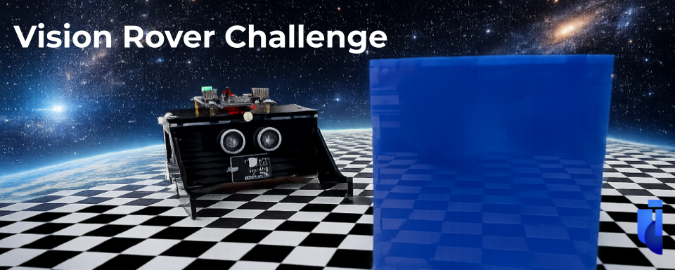

# Vision Rover Challenge

El **Vision Rover Challenge** es un reto de robótica colaborativa basado en visión por computadora global.

Dos rovers deben comunicarse y coordinar sus movimientos para localizar y transportar objetos dentro de una superficie de trabajo. Una cámara instalada sobre el área genera un mapa preciso del entorno y proporciona en tiempo real la posición de los rovers, los objetos y los puntos de destino.

El desafío consiste en construir la infraestructura de software necesaria para:

* Recibir y procesar la información del sistema de visión global.
* Determinar la posición y orientación de cada rover.
* Identificar la ubicación de los objetos cúbicos y sus destinos.
* Planificar rutas y coordinar las acciones de ambos rovers.
* Transmitir comandos de movimiento a los robots.
* Evitar colisiones y completar las tareas de manera eficiente.

El objetivo es que los rovers encuentren los objetos, los transporten y los coloquen en puntos específicos del espacio.

> Este repositorio está en desarrollo. Muy pronto encontrarás ejemplos de código, tutoriales, documentación y otros recursos relacionados con el reto. ¡Vuelve pronto!

**¡El equipo que complete el reto con mayor rapidez, precisión y eficiencia será el ganador!**

## Contenidos:

- [Especificaciones del Robot](https://github.com/Universidad-Cenfotec/Vision-Robotic-Challenge/blob/main/robot.md)
- [Reglamento del VIsion Rover Challenge](https://github.com/Universidad-Cenfotec/Vision-Rover-Challenge/blob/main/reglamento.md)
- [Códigos en python de movimientos, sensores, control etc, del rover](https://github.com/Universidad-Cenfotec/Vision-Rover-Challenge/blob/main/codigos/README.md)
